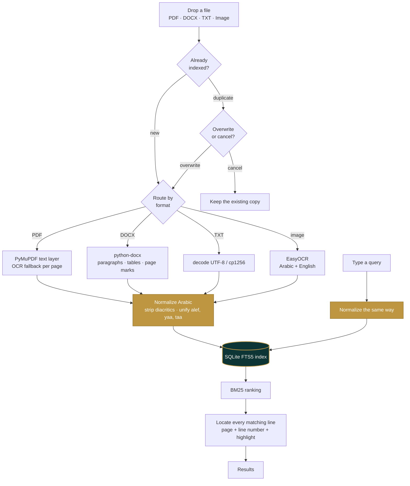

<p align="center">
  
</p>

<p align="center">
  <b>A private, fully offline desktop app for searching your Arabic &amp; English documents.</b><br>
  No cloud &middot; no account &middot; no uploads &mdash; everything stays on your machine.
</p>

<p align="center">
  
  
  
  
</p>

---

## The idea

WaraqVault turns a scattered pile of files &mdash; PDFs, Word documents, and scanned images spread
across WhatsApp, email, and phone storage &mdash; into a **private, instantly searchable archive**
that lives entirely on your own computer. You drag documents in; you search; you get back every
matching line, with its page and line number and the term highlighted. Nothing is ever uploaded.

The hard part it gets right is **Arabic search**. Most tools stumble on Arabic because they
mishandle right-to-left text, diacritics, and letter variants &mdash; so a search for one spelling
silently misses the *same word* typed another way. WaraqVault normalizes Arabic at **both index time
and query time**, so a match happens no matter how either was written.

## The differentiator &mdash; Arabic done right

| You search for | …and it still finds | They differ only by |
|---|---|---|
| `ارشيف` | `أرشيف` | hamza on the alef |
| `مستشفي` | `مستشفى` | yāʾ vs. alef maqṣūra |
| `وثيقه` | `وثيقة` | hāʾ vs. tāʾ marbūṭa |
| `مكتب` | `مُكْتَب` | diacritics (tashkīl) |

This is the part existing tools consistently get wrong &mdash; and the reason WaraqVault exists.

## What it does today

- **Dark &amp; light modes** &mdash; a vault-at-night theme and a daylight reading-room theme,
  toggled from the header and remembered between visits.
- **File manager sidebar** &mdash; browse the whole archive, filter by workspace, type or name,
  select many files at once and delete them in one action.
- **Workspaces** &mdash; group documents on upload (a flat tag, not nested folders), search inside
  one group, or delete a whole group in a single shot.
- **Drag-and-drop ingest** &mdash; drop files (or click) and they are read, indexed and searchable.
- **Batch upload that matches the real cost** &mdash; up to **50** PDF/DOCX/TXT files at once
  (text extraction is cheap), up to **5 images** (OCR is not), with a live status per file.
- **Background processing with real progress** &mdash; uploads return immediately; a progress bar
  advances on actual per-page / per-image completion events, and a **Cancel** button stops
  the job at the next safe point. The UI never freezes, whatever the file size.
- **GPU auto-detection** &mdash; OCR runs on the GPU when one is present; otherwise it falls back
  to a bounded CPU mode (cores&nbsp;&minus;&nbsp;1 threads) that keeps the app responsive. GPU failures
  at runtime fall back to CPU automatically &mdash; never a crash.
- **Live search** &mdash; results update as you type (300&nbsp;ms debounce, minimum 2 characters).
- **Every match, not just one** &mdash; each document lists *all* of its matching lines, not a single snippet.
- **Honest locations** &mdash; PDF/TXT hits are labelled `p.12 / L340`, Word hits show real
  paragraphs (`¶12`), and image hits show clean OCR text with no invented line numbers.
- **Arabic that actually matches** &mdash; searching `تخطيطا` also finds `وتخطيطا` / `بالتخطيط`
  (attached conjunctions, prepositions and the definite article), while short words like
  `في` and `مع` match only as whole words &mdash; no more highlights inside unrelated words.
- **Language badges** &mdash; each result is tagged AR, EN or AR·EN from its real content.
- **Search inside one file** &mdash; a scope filter restricts search to a chosen document; clearing
  it restores full-archive search.
- **Delete from the archive** &mdash; remove a document (with confirmation); its search-index
  entries go with it, no orphaned rows.
- **Large scans ask first** &mdash; a PDF needing OCR on more than 10 pages opens a confirmation
  with a time estimate for *your* hardware, and lets you process **only the pages you name**
  (`1-10, 15, 22-30`) instead of the whole book.
- **Duplicate detection** &mdash; re-uploading a known file prompts you to *overwrite* or *cancel*,
  before any processing starts; renamed copies are caught by content hash.
- **Force OCR** &mdash; a toggle for hybrid PDFs (text + embedded scans) that processes every page
  as an image, and reads images embedded inside DOCX files.
- **Honest file typing** &mdash; a file's real content signature must match its extension, so an
  ODT renamed to `.pdf` is rejected with a clear message instead of poisoning the index.
- **RTL-aware UI** &mdash; each result line picks its own direction, so Arabic and English both read correctly.

## Supported formats

| Format | How the text is extracted | Page numbers |
|---|---|---|
| **PDF** | PyMuPDF text layer; pages with little or no text fall back to OCR | ✅ real pages |
| **DOCX** | python-docx &mdash; paragraphs, tables and content controls, in document order | ✅ pages from Word's saved pagination, positions as paragraphs (¶) |
| **TXT** | decoded as UTF‑8, then cp1256 / ISO‑8859‑6 for Arabic files saved on Windows | line numbers only |
| **Images** (PNG, JPG, BMP, TIFF, WEBP) | EasyOCR (Arabic + English) | OCR text blocks &mdash; no line numbers (images have none) |

> Legacy **`.doc`** is not supported &mdash; save it as `.docx` first. The app tells you so explicitly.
> Files with **no extension** are fine: the server identifies them from their actual content
> (magic bytes for PDF/DOCX/images, text sniffing for plain text).

## Quickstart

> **Python 3.10 – 3.12.** Newer versions (3.13/3.14) do not yet have PyTorch wheels, which EasyOCR
> needs, and the install will fail while trying to build from source.

```bash
python -m venv .venv
```

Install the dependencies (this pulls PyTorch, so it is a large download):

```bash
.venv/Scripts/python.exe -m pip install -r requirements.txt
```

Run the server:

```bash
.venv/Scripts/python.exe main.py
```

Then open **<http://127.0.0.1:8000>**.

On Linux/macOS use `.venv/bin/python` instead of `.venv/Scripts/python.exe`.

**The first run needs internet** &mdash; EasyOCR downloads its Arabic/English models (a few hundred
MB) before the server reports `Uvicorn running`. After that, the app is fully offline.

## How it works



1. **Ingest** &mdash; `POST /upload` hashes the file (SHA‑256) and checks for a duplicate *before* doing
   any expensive work, so you are never left waiting on OCR just to be told the file already exists.
2. **Extract** &mdash; the file is routed by extension first, then content type, to the matching engine.
   Text is emitted one item per line, with `--- صفحة N ---` markers where page information exists.
3. **Normalize** &mdash; Arabic is folded (diacritics stripped, alef/yaa/taa-marbuta variants unified)
   and stored alongside the raw text.
4. **Index** &mdash; the normalized text goes into a SQLite **FTS5** virtual table, kept in sync by triggers.
5. **Search** &mdash; the query is normalized the same way, ranked with **BM25**, then every matching line
   is located, tagged with its page and line number, and its matched words wrapped for highlighting.

Everything runs on `127.0.0.1`. No network calls are made after the one-time model download.

## API

The UI is a thin client over four local endpoints.

| Method | Route | Purpose |
|---|---|---|
| `GET` | `/` | Serves the UI |
| `GET` | `/status` | Health + the active OCR device (GPU name, or CPU with thread count) |
| `GET` | `/search?q=…` | Search; needs ≥ 2 characters. Optional `doc_id` / `workspace` narrow the scope |
| `GET` | `/documents` | List indexed documents (feeds the file manager); optional `workspace` |
| `DELETE` | `/documents/{id}` | Delete one document; the FTS index entry goes with it |
| `POST` | `/documents/delete` | Bulk delete — JSON body `{ "ids": [1,2,3] }` |
| `GET` | `/workspaces` | List workspaces with their document counts |
| `DELETE` | `/workspaces/{name}` | Delete a whole workspace and every document in it |
| `POST` | `/upload` | Multipart `file` ×1–50 (≤5 images), optional `overwrite`, `force_ocr`, `workspace`, `pages`, `confirmed`. Returns **202 + job id** |
| `GET` | `/jobs/{id}` | Job progress: percent, current page/image, per-file statuses, queue position |
| `POST` | `/jobs/{id}/cancel` | Cancel a queued or running job at the next safe point |

**`GET /search?q=ارشيف`**

```jsonc
{
  "query": "ارشيف",
  "count": 1,
  "results": [
    {
      "filename": "annual_report.docx",
      "content_type": "application/vnd.openxmlformats-officedocument.wordprocessingml.document",
      "snippet": "…تقرير <b>الأرشيف</b> السنوي…",
      "rank": -1.83,
      "match_count": 430,          // true total across the document
      "matches": [                 // up to 1000 lines, each highlighted
        { "line": 77, "page": 3, "text": "تقرير <b>الأرشيف</b> السنوي" }
      ]
    }
  ]
}
```

**`POST /upload`** validates everything up front (size, format, duplicates) and then answers
**202 Accepted** with `{ "job_id" }` — the heavy work happens in a background queue, one job at
a time. The UI polls `GET /jobs/{id}`, whose progress counters advance on real per-page /
per-image completion events, and shows the final report from `job.result`
(`{ indexed, skipped, failed, replaced }`).

Two responses interrupt the flow on purpose, both *before* any OCR runs. A **413** means the
upload would OCR more than 10 scanned pages — the body carries the page counts, a time estimate
for the detected device, and whether page selection is possible, which the UI turns into a
consent dialog:

```jsonc
{ "detail": { "reason": "confirm_ocr", "total_scanned_pages": 40, "estimate_seconds": 600,
              "device": "CPU (31 threads)", "page_selection_allowed": true,
              "files": [ { "name": "book.pdf", "total_pages": 42, "scanned_pages": 40 } ] } }
```

Re-send with `confirmed=true` (and optionally `pages=1-10,15`) to proceed. A **409** means a single
uploaded document is already indexed, which the UI turns into an overwrite / cancel prompt —
inside a batch, duplicates are skipped and reported per item instead:

```jsonc
{ "detail": { "reason": "duplicate", "match": "content", "filename": "notes.txt", "indexed_at": "…" } }
```

`match` is `"content"` when the file's hash is already known (so a **renamed copy is still caught**),
or `"filename"` when the name matches but the contents changed.

## Project structure

| Path | What it is |
|---|---|
| [`main.py`](main.py) | FastAPI app: routing, format detection, duplicate checks, the four endpoints |
| [`engine/database.py`](engine/database.py) | Arabic normalization, FTS5 schema, search, per-line matching, duplicate lookup |
| [`engine/pdf_engine.py`](engine/pdf_engine.py) | Hybrid PDF extraction, page pre-check, page subsets, OCR fallback per page |
| [`engine/docx_engine.py`](engine/docx_engine.py) | DOCX extraction in document order, heading merging, embedded-image OCR |
| [`engine/text_engine.py`](engine/text_engine.py) | Plain-text decoding with Arabic encoding fallbacks |
| [`engine/ocr_engine.py`](engine/ocr_engine.py) | GPU-detecting EasyOCR reader with CPU fallback (Arabic + English) |
| [`engine/jobs.py`](engine/jobs.py) | The background job queue: progress events, cancellation, per-item status |
| [`engine/textflow.py`](engine/textflow.py) | Smart OCR line merging and page-map lookup, shared by all engines |
| [`ui/index.html`](ui/index.html) | The app shell markup, rendered through Jinja2 |
| [`ui/css/`](ui/css) | `base.css` (dark + light tokens, app grid) and `components.css` (panels, cards, dialogs) |
| [`ui/js/`](ui/js) | ES modules: `app` (entry), `theme`, `files`, `search`, `upload`, `results`, `modal`, `dom`, `utils` |
| [`tests/test_regression.py`](tests/test_regression.py) | 93-check end-to-end suite (stubbed OCR, throwaway DB) |
| [`docs/plan.md`](docs/plan.md) | The build plan &amp; team roles for the sprint |
| `waraq.db` | The local SQLite index. Created on first run, and git-ignored &mdash; it is rebuildable |

## Notes &amp; troubleshooting

- **OCR is slow on CPU.** Scanned pages run roughly 5–30 seconds *each*; a scanned book can take
  tens of minutes. Pages that already have a text layer are near-instant. The progress bar shows
  the current page and you can cancel at any time; jobs queue up one at a time so the app stays
  responsive throughout. A `pin_memory ... no accelerator` warning from PyTorch during OCR is
  harmless and expected. With a CUDA GPU, OCR is picked up automatically and runs much faster.
- **Dev-mode reloads kill in-flight jobs.** `main.py` runs uvicorn with `reload=True`; saving a
  source file mid-job restarts the server and the job is lost (the UI reports it). Re-upload after
  the restart.
- **The UI is cached hard.** After changing anything under `ui/`, hard-refresh with `Ctrl`+`F5`.
- **ES modules need HTTP.** Open the app through the server, not by double-clicking `ui/index.html`.
- **Re-indexing.** Text is extracted once at upload time, so changes to an extraction engine only
  affect documents uploaded afterwards. Re-upload and choose *Overwrite* to refresh one.
- **Upgrading is safe.** New columns are added by in-place `ALTER TABLE` migrations on startup —
  you never need to delete `waraq.db` to pick up a new version. Documents indexed by older
  versions keep working, including their page numbers.
- **Starting over.** Stop the server and delete `waraq.db`; it is rebuilt empty on the next run.
- **DOCX page numbers** come from the pagination Word recorded when it last saved the file. A
  document written by another tool, with no page breaks of its own, shows line numbers only &mdash;
  deliberately, rather than guessing a page and sending you to the wrong place.

## Privacy

Documents are read, indexed and searched entirely on your machine. Extracted text lives in the local
`waraq.db`; the original files are never copied, moved, or transmitted. The only network access the
project ever needs is the one-time OCR model download during setup.

## Status &amp; roadmap

- [x] Arabic normalization (applied at index **and** query time)
- [x] SQLite **FTS5** index + BM25-ranked search
- [x] PDF / DOCX / TXT parsing, plus OCR for scanned images
- [x] FastAPI server wiring the UI to the engine
- [x] Themed, RTL-aware web UI with drag-and-drop ingest
- [x] All matching lines per document, with page &amp; line numbers and highlighting
- [x] Duplicate detection with overwrite / cancel
- [x] Background job queue with real progress and cancellation
- [x] GPU auto-detection with safe CPU fallback
- [x] Multi-image upload (up to 5 per batch) with per-image status
- [x] Manage the library: per-file search scope and deletion
- [x] Arabic proclitic matching (`تخطيطا` ↔ `وتخطيطا`) and strict short-word search
- [x] Dark / light themes and a full file-manager UI
- [x] Workspaces, bulk deletion, and page-range selection for large scans
- [x] Clean search index — no injected page markers, smart OCR paragraph merging
- [ ] Open or reveal the original file from a result

## Team

Both of us worked across the stack; these are the areas each of us led.

- **Link-Top** — Backend foundations: the initial FastAPI server, the hybrid ingestion routing for PDFs and images (PyMuPDF & EasyOCR), and the first SQLite FTS5 setup.
- **AnmarTiger** — Search engine, ingestion and product surface: the Arabic normalization algorithm and the FTS5 search mechanics (BM25 ranking, per-line matching with page and line numbers, highlighting); DOCX and TXT ingestion; duplicate detection with overwrite/cancel; and the web UI end to end — drag-and-drop ingest, the results view, and the modular CSS/JS front end.

## License

[AGPL-3.0](LICENSE) &mdash; free and open source (copyleft).

If you run a modified version of WaraqVault as a network service, the AGPL requires you to
offer its users the corresponding source code of your modified version.
