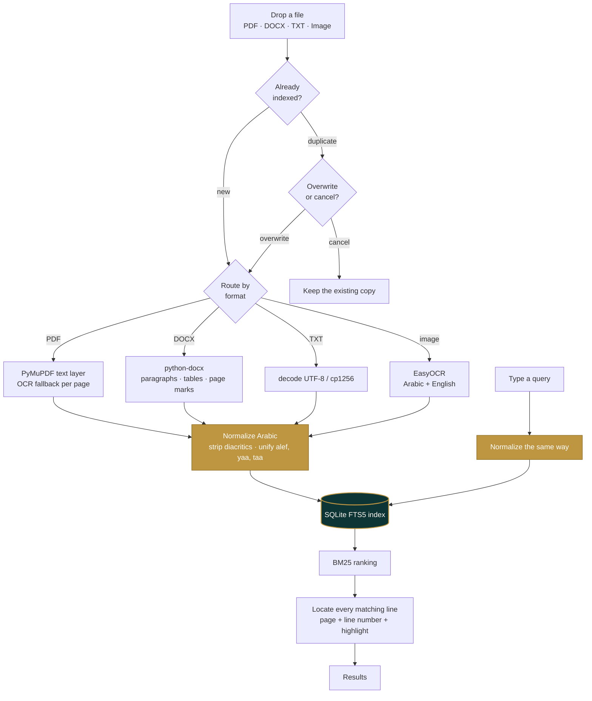

<p align="center">
  
</p>

<p align="center">
  <b>A private, fully offline desktop app for searching your Arabic &amp; English documents.</b><br>
  No cloud &middot; no account &middot; no uploads &mdash; everything stays on your machine.
</p>

<p align="center">
  
  
  
  
</p>

---

### Contents

[The idea](#the-idea) &middot;
[Getting started](#getting-started) &middot;
[GPU passthrough for Docker](#gpu-passthrough-for-docker) &middot;
[GPU for source or venv installs](#gpu-for-source-or-venv-installs) &middot;
[How it works](#how-it-works) &middot;
[API](#api) &middot;
[Project structure](#project-structure) &middot;
[Troubleshooting](#notes--troubleshooting) &middot;
[Privacy](#privacy)

## The idea

WaraqVault turns a scattered pile of files &mdash; PDFs, Word documents, and scanned images spread
across WhatsApp, email, and phone storage &mdash; into a **private, instantly searchable archive**
that lives entirely on your own computer. You drag documents in; you search; you get back every
matching line, with its page and line number and the term highlighted. Nothing is ever uploaded.

The hard part it gets right is **Arabic search**. Most tools stumble on Arabic because they
mishandle right-to-left text, diacritics, and letter variants &mdash; so a search for one spelling
silently misses the *same word* typed another way. WaraqVault normalizes Arabic at **both index time
and query time**, so a match happens no matter how either was written.

## The differentiator &mdash; Arabic done right

| You search for | …and it still finds | They differ only by |
|---|---|---|
| `ارشيف` | `أرشيف` | hamza on the alef |
| `مستشفي` | `مستشفى` | yāʾ vs. alef maqṣūra |
| `وثيقه` | `وثيقة` | hāʾ vs. tāʾ marbūṭa |
| `مكتب` | `مُكْتَب` | diacritics (tashkīl) |

This is the part existing tools consistently get wrong &mdash; and the reason WaraqVault exists.

## What it does today

- **Dark &amp; light modes** &mdash; a vault-at-night theme and a daylight reading-room theme,
  toggled from the header and remembered between visits.
- **File manager sidebar** &mdash; browse the whole archive, filter by workspace, type or name,
  select many files at once and delete them in one action.
- **Workspaces** &mdash; group documents on upload (a flat tag, not nested folders), search inside
  one group, or delete a whole group in a single shot.
- **Drag-and-drop ingest** &mdash; drop files (or click) and they are read, indexed and searchable.
- **Batch upload that matches the real cost** &mdash; up to **50** PDF/DOCX/TXT files at once
  (text extraction is cheap), up to **5 images** (OCR is not), with a live status per file.
- **Background processing with real progress** &mdash; uploads return immediately; a progress bar
  advances on actual per-page / per-image completion events, and a **Cancel** button stops
  the job at the next safe point. The UI never freezes, whatever the file size.
- **GPU auto-detection** &mdash; OCR runs on the GPU when one is present; otherwise it falls back
  to a bounded CPU mode (cores&nbsp;&minus;&nbsp;1 threads) that keeps the app responsive. GPU failures
  at runtime fall back to CPU automatically &mdash; never a crash.
- **Live search** &mdash; results update as you type (300&nbsp;ms debounce, minimum 2 characters).
- **Every match, not just one** &mdash; each document lists *all* of its matching lines, not a single snippet.
- **Honest locations** &mdash; PDF and Word hits are labelled by **page** (`p.12`), text files by
  **line** (`L340`), and image hits carry no position at all. Nothing is ever invented: a number
  only appears where you can actually go and find it.
- **Arabic that actually matches** &mdash; searching `تخطيطا` also finds `وتخطيطا` / `بالتخطيط`
  (attached conjunctions, prepositions and the definite article), while short words like
  `في` and `مع` match only as whole words &mdash; no more highlights inside unrelated words.
- **Language badges** &mdash; each result is tagged AR, EN or AR·EN from its real content.
- **Search inside one file** &mdash; a scope filter restricts search to a chosen document; clearing
  it restores full-archive search.
- **Delete from the archive** &mdash; remove a document (with confirmation); its search-index
  entries go with it, no orphaned rows.
- **No page limit &mdash; but large scans ask first.** A PDF of any length is accepted. Past 5 scanned
  pages a dialog shows a time estimate for *your* hardware and offers three choices: all pages, a
  **page range**, or **specific pages** &mdash; with the estimate updating live as you narrow it down.
  Nothing is ever refused for being too big.
- **Open the original** &mdash; every indexed document keeps a local copy, openable straight from the
  file manager, the details panel, or any search result.
- **Duplicate detection** &mdash; re-uploading a known file prompts you to *overwrite* or *cancel*,
  before any processing starts; renamed copies are caught by content hash.
- **Force OCR** &mdash; a toggle for hybrid PDFs (text + embedded scans) that processes every page
  as an image, and reads images embedded inside DOCX files.
- **Honest file typing** &mdash; a file's real content signature must match its extension, so an
  ODT renamed to `.pdf` is rejected with a clear message instead of poisoning the index.
- **RTL-aware UI** &mdash; each result line picks its own direction, so Arabic and English both read correctly.

## Supported formats

| Format | How the text is extracted | Page numbers |
|---|---|---|
| **PDF** | PyMuPDF text layer; pages with little or no text fall back to OCR | ✅ real pages |
| **DOCX** | python-docx &mdash; paragraphs, tables and content controls, in document order | ✅ page numbers from Word's saved pagination |
| **TXT** | decoded as UTF‑8, then cp1256 / ISO‑8859‑6 for Arabic files saved on Windows | line numbers only |
| **Images** (PNG, JPG, BMP, TIFF, WEBP) | EasyOCR (Arabic + English) | OCR text blocks &mdash; no line numbers (images have none) |

> Legacy **`.doc`** is not supported &mdash; save it as `.docx` first. The app tells you so explicitly.
> Files with **no extension** are fine: the server identifies them from their actual content
> (magic bytes for PDF/DOCX/images, text sniffing for plain text).

## Getting started

Three ways to run WaraqVault — pick whichever fits:

| | Best for | Setup effort | GPU support |
|---|---|---|---|
| **[Source / venv](#run-from-source)** | Development, and the only path with easy GPU acceleration | Python venv + `pip install` | Straightforward |
| **[Docker](#docker-alternative-to-the-venv-setup)** | No local Python install, isolated & reproducible | `docker compose up` | Needs the [NVIDIA Container Toolkit](#gpu-passthrough-for-docker) |
| **[Windows installer](#desktop-installer-windows-msi-exe)** | Non-technical end users on Windows | Download & run `.msi`/`.exe` | Whatever the machine's Python/PyTorch stack provides |

All three run the exact same engine and produce the exact same search results — the only
difference is packaging.

### Run from source

> **Python 3.10 – 3.12.** Newer versions (3.13/3.14) do not yet have PyTorch wheels, which EasyOCR
> needs, and the install will fail while trying to build from source.

```bash
python -m venv .venv
```

Install the dependencies (this pulls PyTorch, so it is a large download):

```bash
.venv/Scripts/python.exe -m pip install -r requirements.txt
```

Run the server:

```bash
.venv/Scripts/python.exe main.py
```

Then open **<http://127.0.0.1:8000>**.

On Linux/macOS use `.venv/bin/python` instead of `.venv/Scripts/python.exe`.

**The first run needs internet** &mdash; EasyOCR downloads its Arabic/English models (a few hundred
MB) before the server reports `Uvicorn running`. After that, the app is fully offline.

### Docker (alternative to the venv setup)

The repo also ships a `Dockerfile` and `docker-compose.yml` that run WaraqVault alongside
**Gotenberg** (used for DOCX&rarr;PDF conversion) in an isolated network, with no manual Python
setup:

```bash
docker compose up --build
```

Then open **<http://127.0.0.1:8000>**. A few things worth knowing:

- **`storage/`** is bind-mounted from the host (`./storage:/app/storage`), so your indexed
  originals and the SQLite index (`storage/waraq.db`) survive `docker compose down` and rebuilds.
- **EasyOCR's downloaded models** live in a named volume (`easyocr-models`), so the first-run
  download only happens once, not on every rebuild.
- Gotenberg has no ports exposed to the host &mdash; it's reachable only from the `waraq` container
  over the internal `waraq-net` network, at `http://gotenberg:3000`.
- GPU passthrough needs one extra step on the host first &mdash; see the next section.

### GPU passthrough for Docker

By default the container can't see any GPU, even if the host has one — Docker isolates devices
the same way it isolates everything else. `docker-compose.yml` already declares an NVIDIA device
reservation on the `waraq` service, but that only *asks* Docker for a GPU; actually granting it
needs the **NVIDIA Container Toolkit** installed on the host.

**1. Check the host driver works first** (unrelated to Docker — confirms the driver itself is fine):

```bash
nvidia-smi
```

If that fails or shows no card, fix the host driver before touching Docker at all.

**2. Install the NVIDIA Container Toolkit** (Debian/Ubuntu host):

```bash
curl -fsSL https://nvidia.github.io/libnvidia-container/gpgkey | sudo gpg --dearmor -o /usr/share/keyrings/nvidia-container-toolkit-keyring.gpg
curl -s -L https://nvidia.github.io/libnvidia-container/stable/deb/nvidia-container-toolkit.list | \
  sed 's#deb https://#deb [signed-by=/usr/share/keyrings/nvidia-container-toolkit-keyring.gpg] https://#g' | \
  sudo tee /etc/apt/sources.list.d/nvidia-container-toolkit.list
sudo apt-get update && sudo apt-get install -y nvidia-container-toolkit
sudo nvidia-ctk runtime configure --runtime=docker
sudo systemctl restart docker
```

For other distros, see NVIDIA's [install
guide](https://docs.nvidia.com/datacenter/cloud-native/container-toolkit/latest/install-guide.html).

**3. Rebuild and check:**

```bash
docker compose up -d --build
docker compose logs waraq | grep -i nvidia
```

You want to see `NVIDIA detected: <your card> (...)` — not `لا توجد بطاقة NVIDIA` ("no NVIDIA
card"). If the card still isn't detected, re-check step 1 and step 2 in order; the toolkit can't
pass through a driver that doesn't work on the host.

> **Without the toolkit installed, `docker compose up` fails to start the container at all**
> (it does not silently fall back to CPU) &mdash; the reservation in `docker-compose.yml` has
> nothing to satisfy it. If you don't have an NVIDIA GPU, remove the `deploy:` block from the
> `waraq` service in `docker-compose.yml` and the container runs on CPU normally.

### Desktop installer (Windows .msi / .exe)

WaraqVault can also ship as a self-contained Windows desktop app, built with
[Tauri](https://tauri.app). The Tauri shell spawns the FastAPI backend (frozen into a standalone
executable with PyInstaller) as a background process, waits for it to report ready, then opens a
window pointed at it &mdash; same app, no browser, no manual setup, no internet required after
install (EasyOCR's first-run model download still needs one).

Because Gotenberg is Docker-only, the desktop build swaps it for a bundled portable LibreOffice
and does DOCX&rarr;PDF conversion by shelling out to `soffice --headless` directly
(`engine/libreoffice_client.py`, selected via `PDF_ENGINE=libreoffice`) instead of talking to a
Gotenberg container. `engine/paths.py` is what makes the same codebase work unmodified whether
it's running from source, frozen, or in Docker &mdash; it resolves the bundled `ui/` folder and a
writable per-user data directory correctly in each case.

### GPU for source or venv installs

*(Running in Docker instead? See [GPU passthrough for Docker](#gpu-passthrough-for-docker) above —
this section is for the source/venv and desktop-installer paths, where the app talks to PyTorch
directly.)*

OCR runs **10–30× faster** on a CUDA GPU, and the app picks one up automatically. The catch is
PyTorch itself:

> **On Windows, `pip install torch` gives you a CPU-only build.** Even with a healthy NVIDIA card
> and a current driver, `torch.version.cuda` is `None` and the GPU is never touched. On Linux the
> default PyPI wheel usually already bundles CUDA.

The app detects this exact situation and says so: the header chip turns into
**⚠ GPU idle — <your card>** and `/device` returns the reason plus the command to fix it.

```bash
.venv/Scripts/python.exe -m pip install --force-reinstall torch torchvision --index-url https://download.pytorch.org/whl/cu130
```

Pick the CUDA build that matches your card &mdash; **RTX 50-series (Blackwell) needs cu128 or newer**;
`cu126` will install but cannot run on those cards. Check what exists at
<https://download.pytorch.org/whl/>. On Linux use `.venv/bin/python` and, if the default PyPI
wheel already reports CUDA, no reinstall is needed at all.

Verify afterwards:

```bash
.venv/Scripts/python.exe -c "import torch; print(torch.__version__, torch.cuda.is_available())"
```

You want `True` &mdash; then restart the server and the chip should read **⚡ GPU (…)**.

### Choosing the hardware

The header has an **Auto / GPU / CPU** selector:

| Mode | Behaviour |
|---|---|
| **Auto** (default) | GPU when usable, otherwise CPU |
| **GPU** | forces the GPU; refused with a clear reason if it isn't usable |
| **CPU** | pins to CPU (`cores − 1` threads) &mdash; useful while gaming or to keep the GPU free |

The choice is remembered between visits, applies immediately (models reload in the background),
and a GPU that runs out of memory mid-job still falls back to CPU on its own.

## How it works



1. **Ingest** &mdash; `POST /upload` hashes the file (SHA‑256) and checks for a duplicate *before* doing
   any expensive work, so you are never left waiting on OCR just to be told the file already exists.
2. **Extract** &mdash; the file is routed by extension first, then content type, to the matching engine.
   Text is emitted one item per line, with `--- صفحة N ---` markers where page information exists.
3. **Normalize** &mdash; Arabic is folded (diacritics stripped, alef/yaa/taa-marbuta variants unified)
   and stored alongside the raw text.
4. **Index** &mdash; the normalized text goes into a SQLite **FTS5** virtual table, kept in sync by triggers.
5. **Search** &mdash; the query is normalized the same way, ranked with **BM25**, then every matching line
   is located, tagged with its page and line number, and its matched words wrapped for highlighting.

Everything runs on `127.0.0.1`. No network calls are made after the one-time model download.

## API

The UI is a thin client over four local endpoints.

| Method | Route | Purpose |
|---|---|---|
| `GET` | `/` | Serves the UI |
| `GET` | `/status` | Health + the active OCR device (GPU name, or CPU with thread count) |
| `GET` | `/device` | Hardware report: active device, whether a GPU exists, and why it is idle |
| `POST` | `/device` | Switch hardware — JSON body `{ "mode": "auto" | "gpu" | "cpu" }` |
| `GET` | `/search?q=…` | Search; needs ≥ 2 characters. Optional `doc_id` / `workspace` narrow the scope |
| `GET` | `/documents` | List indexed documents (feeds the file manager); optional `workspace` |
| `GET` | `/documents/{id}/open` | Stream the stored original (inline, so PDFs/images render) |
| `DELETE` | `/documents/{id}` | Delete one document; its FTS entry and stored copy go with it |
| `POST` | `/documents/delete` | Bulk delete — JSON body `{ "ids": [1,2,3] }` |
| `GET` | `/workspaces` | List workspaces with their document counts |
| `DELETE` | `/workspaces/{name}` | Delete a whole workspace and every document in it |
| `POST` | `/upload` | Multipart `file` ×1–50 (≤5 images), optional `overwrite`, `force_ocr`, `workspace`, `pages`, `confirmed`. Returns **202 + job id** |
| `GET` | `/jobs/{id}` | Job progress: percent, current page/image, per-file statuses, queue position |
| `POST` | `/jobs/{id}/cancel` | Cancel a queued or running job at the next safe point |

**`GET /search?q=ارشيف`**

```jsonc
{
  "query": "ارشيف",
  "count": 1,
  "results": [
    {
      "filename": "annual_report.docx",
      "content_type": "application/vnd.openxmlformats-officedocument.wordprocessingml.document",
      "snippet": "…تقرير <b>الأرشيف</b> السنوي…",
      "rank": -1.83,
      "match_count": 430,          // true total across the document
      "matches": [                 // up to 1000 lines, each highlighted
        { "line": 77, "page": 3, "text": "تقرير <b>الأرشيف</b> السنوي" }
      ]
    }
  ]
}
```

**`POST /upload`** validates everything up front (size, format, duplicates) and then answers
**202 Accepted** with `{ "job_id" }` — the heavy work happens in a background queue, one job at
a time. The UI polls `GET /jobs/{id}`, whose progress counters advance on real per-page /
per-image completion events, and shows the final report from `job.result`
(`{ indexed, skipped, failed, replaced }`).

Two responses interrupt the flow on purpose, both *before* any OCR runs. A **413** means the
upload would OCR more than 10 scanned pages — the body carries the page counts, a time estimate
for the detected device, and whether page selection is possible, which the UI turns into a
consent dialog:

```jsonc
{ "detail": { "reason": "confirm_ocr", "total_scanned_pages": 40, "estimate_seconds": 600,
              "device": "CPU (31 threads)", "page_selection_allowed": true,
              "files": [ { "name": "book.pdf", "total_pages": 42, "scanned_pages": 40 } ] } }
```

Re-send with `confirmed=true` (and optionally `pages=1-10,15`) to proceed. A **409** means a single
uploaded document is already indexed, which the UI turns into an overwrite / cancel prompt —
inside a batch, duplicates are skipped and reported per item instead:

```jsonc
{ "detail": { "reason": "duplicate", "match": "content", "filename": "notes.txt", "indexed_at": "…" } }
```

`match` is `"content"` when the file's hash is already known (so a **renamed copy is still caught**),
or `"filename"` when the name matches but the contents changed.

## Project structure

| Path | What it is |
|---|---|
| [`main.py`](main.py) | App assembly only: creates the FastAPI app, runs `init_db()` on startup, mounts `ui/` and wires up every router |
| [`routers/`](routers) | Thin FastAPI route handlers, one file per resource &mdash; `pages`, `system`, `search`, `documents`, `workspaces`, `jobs`, `upload`. No business logic lives here |
| [`services/upload_pipeline.py`](services/upload_pipeline.py) | The `/upload` business logic: batch validation (fail-fast) and the background job body that extracts, OCRs and indexes each file |
| [`services/file_detection.py`](services/file_detection.py) | File-kind detection from extension, `Content-Type`, and content magic bytes; the fake-extension guard |
| [`services/workspace.py`](services/workspace.py) | Workspace-name sanitization |
| [`engine/database.py`](engine/database.py) | Arabic normalization, FTS5 schema, search, per-line matching, duplicate lookup |
| [`engine/pdf_engine.py`](engine/pdf_engine.py) | Hybrid PDF extraction, page pre-check, page subsets, OCR fallback per page |
| [`engine/docx_engine.py`](engine/docx_engine.py) | DOCX extraction in document order, heading merging, embedded-image OCR |
| [`engine/text_engine.py`](engine/text_engine.py) | Plain-text decoding with Arabic encoding fallbacks |
| [`engine/ocr_engine.py`](engine/ocr_engine.py) | GPU-detecting EasyOCR reader with CPU fallback (Arabic + English) |
| [`engine/gotenberg_client.py`](engine/gotenberg_client.py) | Async/sync client for the Gotenberg DOCX&rarr;PDF conversion service (Docker deployments) |
| [`engine/libreoffice_client.py`](engine/libreoffice_client.py) | Same DOCX&rarr;PDF job via a local headless `soffice` (desktop build) |
| [`engine/pdf_conversion.py`](engine/pdf_conversion.py) | Picks Gotenberg vs. local LibreOffice via `PDF_ENGINE` |
| [`engine/paths.py`](engine/paths.py) | Resolves the bundled `ui/` dir and a writable data dir across source/frozen/Docker runs |
| [`engine/jobs.py`](engine/jobs.py) | The background job queue: progress events, cancellation, per-item status |
| [`desktop_main.py`](desktop_main.py) | Entry point for the PyInstaller-frozen desktop build (no autoreload, configurable port) |
| [`waraq-backend.spec`](waraq-backend.spec) | PyInstaller spec that freezes the backend for the Tauri sidecar |
| [`src-tauri/`](src-tauri) | The Tauri desktop shell &mdash; spawns the backend, waits for it, opens a window on it |
| [`ui/js/device.js`](ui/js/device.js) | The hardware selector and the "GPU idle" warning |
| [`engine/storage.py`](engine/storage.py) | Local copies of uploaded originals, keyed by hash, pruned when unreferenced |
| [`engine/textflow.py`](engine/textflow.py) | Smart OCR line merging and page-map lookup, shared by all engines |
| [`ui/index.html`](ui/index.html) | The app shell markup, rendered through Jinja2 |
| [`ui/css/`](ui/css) | `base.css` (dark + light tokens, app grid) and `components.css` (panels, cards, dialogs) |
| [`ui/js/`](ui/js) | ES modules: `app` (entry), `theme`, `files`, `search`, `upload`, `results`, `modal`, `dom`, `utils` |
| [`tests/test_regression.py`](tests/test_regression.py) | 134-check end-to-end suite (stubbed OCR, throwaway DB) |
| [`docs/plan.md`](docs/plan.md) | The build plan &amp; team roles for the sprint |
| `storage/waraq.db` | The local SQLite index. Created on first run, and git-ignored &mdash; it is rebuildable |

## Notes &amp; troubleshooting

- **OCR is slow on CPU.** Scanned pages run roughly 5–30 seconds *each*; a scanned book can take
  tens of minutes. Pages that already have a text layer are near-instant. The progress bar shows
  the current page and you can cancel at any time; jobs queue up one at a time so the app stays
  responsive throughout. A `pin_memory ... no accelerator` warning from PyTorch during OCR is
  harmless and expected. With a CUDA GPU, OCR is picked up automatically and runs much faster.
- **Dev-mode reloads kill in-flight jobs.** `main.py` runs uvicorn with `reload=True`; saving a
  source file mid-job restarts the server and the job is lost (the UI reports it). Re-upload after
  the restart.
- **The UI is cached hard.** After changing anything under `ui/`, hard-refresh with `Ctrl`+`F5`.
- **ES modules need HTTP.** Open the app through the server, not by double-clicking `ui/index.html`.
- **Re-indexing.** Text is extracted once at upload time, so changes to an extraction engine only
  affect documents uploaded afterwards. Re-upload and choose *Overwrite* to refresh one.
- **Upgrading is safe.** New columns are added by in-place `ALTER TABLE` migrations on startup —
  you never need to delete `storage/waraq.db` to pick up a new version. Documents indexed by older
  versions keep working, including their page numbers.
- **Starting over.** Stop the server and delete `storage/waraq.db`; it is rebuilt empty on the next run.
- **DOCX page numbers** come from the pagination Word recorded when it last saved the file. A
  document written by another tool, with no page breaks of its own, shows line numbers only &mdash;
  deliberately, rather than guessing a page and sending you to the wrong place.

## OCR development &amp; benchmarking

Notes for whoever is working on the recognition pipeline.

### The seams

Everything that touches OCR goes through **one function**, so a new engine or a new
execution strategy is a local change, not a refactor:

| File | What to change here |
|---|---|
| [`engine/ocr_engine.py`](engine/ocr_engine.py) | `run_ocr_boxes(image)` &mdash; what every caller uses, returns `[(bbox, text, confidence)]`. `run_ocr(image)` keeps the older list-of-strings contract. Device detection, thread pinning and the CUDA-OOM fallback live here |
| [`engine/pdf_engine.py`](engine/pdf_engine.py) | Page rasterisation: `fitz.Matrix(2, 2)` (the render zoom) and `TEXT_LAYER_THRESHOLD = 20` (when a page counts as scanned). `page_paragraphs()` reads the text layer as real blocks via `get_text("dict")` |
| [`engine/jobs.py`](engine/jobs.py) | `ThreadPoolExecutor(max_workers=1)` &mdash; the deliberate serialisation. Page-level parallelism starts here |
| [`ui/js/device.js`](ui/js/device.js) | The hardware selector and the "GPU idle" warning |
| [`engine/storage.py`](engine/storage.py) | Local copies of uploaded originals, keyed by hash, pruned when unreferenced |
| [`engine/textflow.py`](engine/textflow.py) | `join_ocr()` / `join_boxes()` &mdash; paragraphs built from box **geometry**; `smart_join()` is the punctuation fallback for engines that return no coordinates |

Check what hardware you actually got: `curl 127.0.0.1:8000/status`, or watch the startup
log for `✅ OCR engine ready on …`. The header chip in the UI shows the same thing.

### The benchmark harness

Speed changes must be justified against **accuracy**, so the harness measures both:

```bash
.venv/Scripts/python.exe tools/bench_ocr.py --file "scan.pdf" --pages 5 --zoom 1.0,1.5,2.0,3.0
```

It renders the same pages under each setting, times render and OCR separately, and scores the
extracted text against the production baseline (zoom 2.0) using the *same Arabic normalisation
the search index uses* &mdash; so a config that reads Arabic worse is flagged, not rewarded.
`--threads 8,16,31` additionally sweeps CPU thread counts.

A real run on this machine (synthetic 1-page English scan, CPU, 31 threads):

```
config                     render s/pg   ocr s/pg  total s/pg    chars  accuracy  speedup
zoom 2.0 (baseline)               0.12       4.98        5.10       95   100.0%    1.00x
zoom 1.0                          0.01       1.61        1.62       93    87.2%    3.15x  ✗ BAD
8 CPU threads                     0.12       6.51        6.63       95   100.0%    0.77x
```

Two lessons already visible: halving the zoom is **3× faster but loses 13% of the text** &mdash;
exactly the trade the harness exists to catch; and fewer threads was *slower*, so thread tuning
needs measuring rather than guessing. Benchmark on **real Arabic scans with `--pages 5`+**;
single-page runs vary by ~20% and English text is not representative.

### Ground rules

- **Store OCR text verbatim &mdash; never reverse characters.** Measured on real scans in this
  archive, EasyOCR returns Arabic in correct order (`وتم نفيه باتجاه مراكش`), so there is
  nothing to "fix". Reversing characters makes a document **permanently unfindable**: the
  normalised tokens no longer match anything. Word/box *order*, by contrast, is irrelevant to
  search &mdash; `_fts_match_expr` joins tokens with `AND`, not phrase proximity, so a document
  matches whichever order its words appear in. Re-ordering therefore buys nothing for recall
  and only risks display changes.
  > If a test render looks reversed, suspect the render before the engine: text inserted
  > without Arabic shaping produces disconnected glyphs that OCR reads backwards at low
  > confidence. That artefact is almost certainly where the old "reverse order" warning came from.
- **Keep the OCR contracts.** Both take a path, bytes, or a numpy array. `run_ocr_boxes`
  returns `[(bbox, text, confidence)]` and is what the pipeline uses; `run_ocr` returns a plain
  list of strings and is kept for anything that only wants text. `join_ocr()` accepts *either*
  shape, so a replacement engine that cannot supply coordinates still works &mdash; it just falls
  back to punctuation-based paragraphs.
- **Never re-sort OCR boxes.** `join_boxes` groups by vertical geometry but preserves the
  engine's original order, because re-sorting by x would silently change Arabic token order &mdash;
  the exact thing the RTL rule above forbids.
- **Recalibrate the user-facing estimate** in [`services/upload_pipeline.py`](services/upload_pipeline.py)
  (`_EST_SEC_PER_PAGE_CPU = (15.0, 40.0)`, `_EST_SEC_PER_PAGE_GPU = (1.5, 8.0)`) once you have real
  numbers &mdash; it drives the "~N min" the confirmation dialog promises, and the threshold
  `_CONFIRM_SCANNED_PAGES = 5`.
- **Run the suite before and after**: `.venv/Scripts/python.exe tests/test_regression.py`
  (134 checks). It stubs `engine.ocr_engine` in `sys.modules`, so it runs in seconds without
  loading any model &mdash; meaning it validates *routing, indexing and search*, not recognition
  quality. Recognition quality is what the benchmark harness is for.

## Privacy

Documents are read, indexed and searched entirely on your machine. Extracted text lives in the local
`storage/waraq.db`, and a **copy of each uploaded original is kept in `storage/`** so you can open it again
from the app — both are git-ignored and never leave your computer. Your original file, wherever you
keep it, is never moved or altered. The only network access the project ever needs is the one-time
OCR model download during setup.

> Deleting a document also deletes its stored copy. If you would rather not keep copies at all,
> delete the `storage/` folder &mdash; search keeps working, and the *Open original* button simply
> reports that no copy exists.

## Status &amp; roadmap

- [x] Arabic normalization (applied at index **and** query time)
- [x] SQLite **FTS5** index + BM25-ranked search
- [x] PDF / DOCX / TXT parsing, plus OCR for scanned images
- [x] FastAPI server wiring the UI to the engine
- [x] Themed, RTL-aware web UI with drag-and-drop ingest
- [x] All matching lines per document, with page &amp; line numbers and highlighting
- [x] Duplicate detection with overwrite / cancel
- [x] Background job queue with real progress and cancellation
- [x] GPU auto-detection, manual override, and a diagnostic when a card is present but unusable
- [x] Multi-image upload (up to 5 per batch) with per-image status
- [x] Manage the library: per-file search scope and deletion
- [x] Arabic proclitic matching (`تخطيطا` ↔ `وتخطيطا`) and strict short-word search
- [x] Dark / light themes and a full file-manager UI
- [x] Workspaces, bulk deletion, and page-range selection for large scans
- [x] Clean search index — no injected page markers, smart OCR paragraph merging
- [x] Open the original file from a result or the file manager

## Team

Both of us worked across the stack; these are the areas each of us led.

- **Mr.Automic** — Backend foundations: the initial FastAPI server, the hybrid ingestion routing for PDFs and images (PyMuPDF & EasyOCR), and the first SQLite FTS5 setup. He was also responsible for benchmarking these components to validate ingestion accuracy and query performance.
- **AnmarTiger** — Search engine, ingestion and product surface: the Arabic normalization algorithm and the FTS5 search mechanics (BM25 ranking, per-line matching with page and line numbers, highlighting); DOCX and TXT ingestion; duplicate detection with overwrite/cancel; and the web UI end to end — drag-and-drop ingest, the results view, and the modular CSS/JS front end.

## License

[AGPL-3.0](LICENSE) &mdash; free and open source (copyleft).

If you run a modified version of WaraqVault as a network service, the AGPL requires you to
offer its users the corresponding source code of your modified version.
